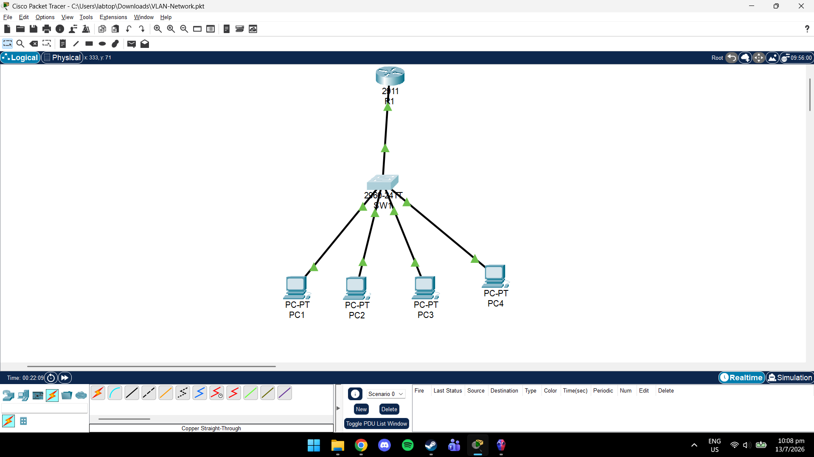
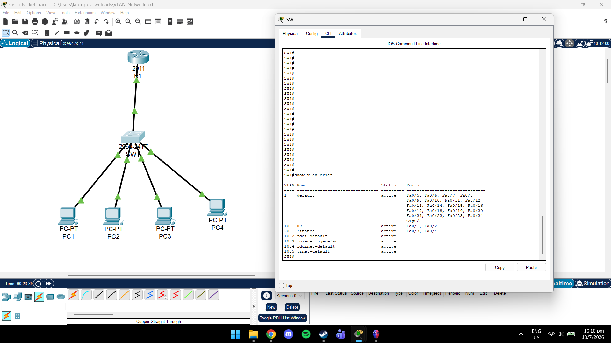
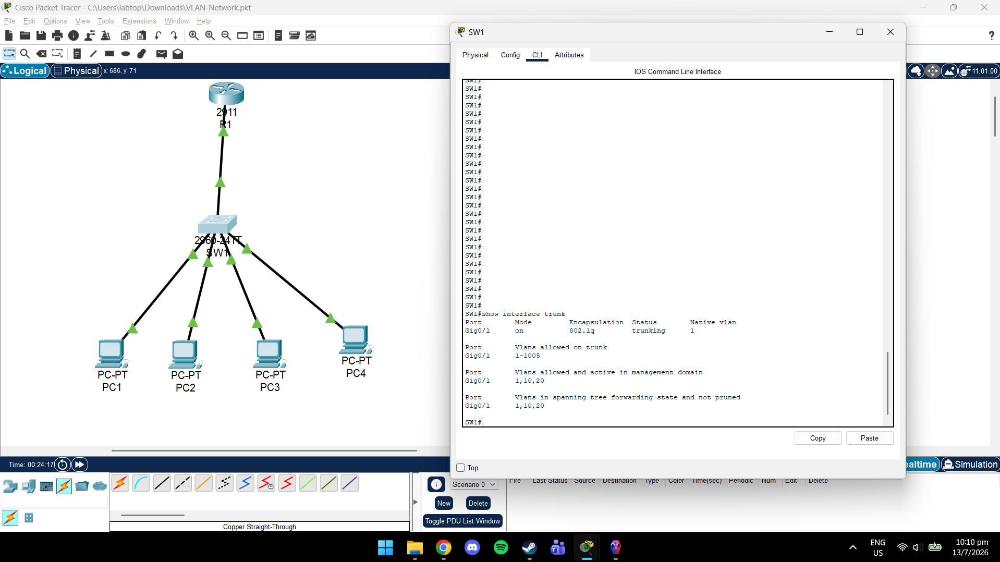
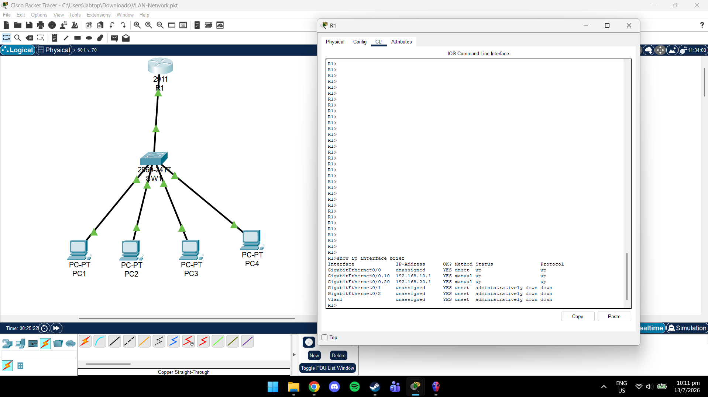
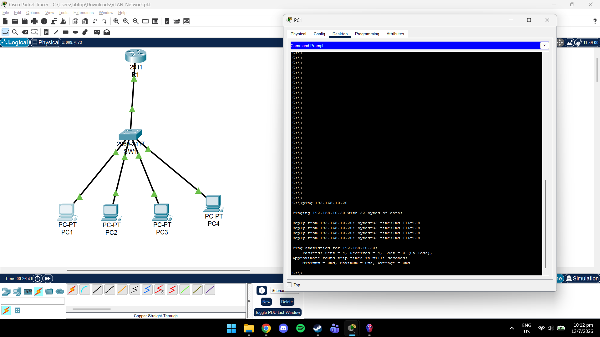
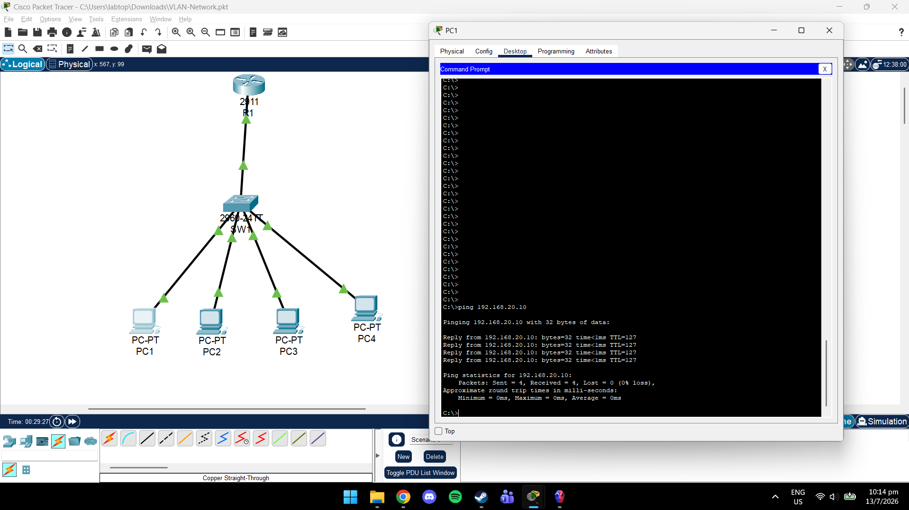

# VLAN Network with Router-on-a-Stick

## Overview

This project demonstrates VLAN segmentation and inter-VLAN routing using Cisco Packet Tracer. Two departments (HR and Finance) are separated into different VLANs, while a Cisco router provides communication between them using Router-on-a-Stick.

---

## Network Topology

```
                R1
                 │
              Trunk
                 │
                SW1
      ┌──────────┴──────────┐
      │                     │
 VLAN 10               VLAN 20
 PC1  PC2             PC3  PC4
```

---

## Technologies Used

- Cisco Packet Tracer
- Cisco IOS CLI
- VLANs
- IEEE 802.1Q Trunking
- Router-on-a-Stick
- IPv4 Addressing

---

## VLAN Configuration

| VLAN | Department | Devices |
|------|------------|---------|
|10|HR|PC1, PC2|
|20|Finance|PC3, PC4|

---

## IP Addressing

| Device | IP Address |
|---------|------------|
|R1 VLAN 10|192.168.10.1|
|R1 VLAN 20|192.168.20.1|
|PC1|192.168.10.10|
|PC2|192.168.10.20|
|PC3|192.168.20.10|
|PC4|192.168.20.20|

---

## Skills Demonstrated

- VLAN Configuration
- Port Assignment
- IEEE 802.1Q Trunking
- Router-on-a-Stick
- Inter-VLAN Routing
- Cisco IOS CLI
- Network Troubleshooting
- Connectivity Testing

---

## Verification

- Successfully created VLAN 10 and VLAN 20.
- Configured switch access ports.
- Configured trunk link between router and switch.
- Configured Router-on-a-Stick using subinterfaces.
- Verified successful communication within the same VLAN.
- Verified successful communication between VLANs through the router.

---

## Screenshots

### Network Topology



### VLAN Configuration



### Trunk Configuration



### Router-on-a-Stick



### Same VLAN Ping



### Inter-VLAN Ping


